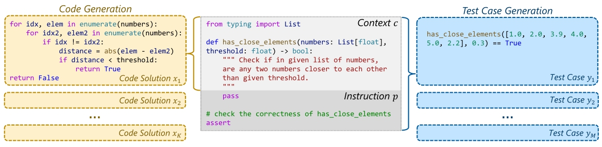

# CodeT: Code Generation with Generated Tests

# Overview

In the paper, we present **CodeT** (for **Code** Generation with Generated **T**ests), a simple yet effective approach to empower large pre-trained language models for code generation, which could achieve surprising improvements over previous methods. For example, we improve the pass@1 on HumanEval to 65.8%, an increase of absolute 18.8% on the OpenAI *code-davinci-002* model, and an absolute 20+% improvement over previous state-of-the-art results.


<center>Fig 1. The illustration of CodeT. Both the code solutions and the test cases are generated by the pre-trained language model. The best code solution is then selected by a dual execution agreement.</center>


<center>Fig 2. Code generation and test case generation: an example from the HumanEval benchmark. (Example input-output cases are removed from the context.)</center>

CodeT leverages large language models to generate both the code solutions and the test cases. We believe a solution could get support from both the test cases and the other solutions. The more test cases a solution can pass, and the more test-driven siblings the solution has, the better the solution is. Hence, We execute the code solutions using the test cases and chooses the best solution based on such dual execution agreement.

## Project

This project contains the basic components of CodeT and a main entry point, here is an overview:

```shell
|-- main.py # the main entry point to use CodeT
|-- src
    |-- postprocess.py # handle code solution and test case post-processing
    |-- _execution.py # perform execution with the given code solutions and test cases
    |-- execution.py # wrapper of the execution process
    |-- agreement.py # perform dual execution agreement of CodeT
    |-- evaluation.py # calculate pass@k results for baseline and CodeT
    |-- io_utils.py # simple utils for file reading/writing
|-- data
    |-- dataset # contains the input data for code solution and test case generation
        |-- hmeval_for_code_generation.jsonl
        |-- hmeval_for_test_case_generation.jsonl
        |-- mbpp_sanitized_for_code_generation.jsonl
        |-- mbpp_sanitized_for_test_case_generation.jsonl
    |-- generated_data # contains the output data by pre-trained language models
        |-- hmeval_incoder6B_temp0.8_topp0.95_num100_max300_test_case.jsonl
        |-- hmeval_incoder6B_temp0.8_topp0.95_num100_max300_code_solution.jsonl
        |-- hmeval_codegen16B_temp0.8_topp0.95_num100_max300_test_case.jsonl
        |-- hmeval_codegen16B_temp0.8_topp0.95_num100_max300_code_solution.jsonl
```

# Quickstart

## Prepare Environment
First, you should set up a python environment. This code base has been tested under python 3.7.

After installing python 3.7, we strongly recommend you to use `virtualenv` to manage the python environment. You could use following commands to create an environment `venv` and activate it.

```bash
$ python3.7 -m venv venv
$ source venv/bin/activate
$ pip install -r requirements.txt
```

## Prepare Data

First, you can find our processed HumanEval and MBPP benchmarks in the `data/dataset` directory, including the data for code solution and test case generation. Then you may reproduce the results of InCoder and CodeGen on the HumanEval benchmark using the data we provide in the `data/generated_data` directory. Or you can feed the input data to the code generation models (e.g. [CodeGen](https://github.com/salesforce/CodeGen) and [InCoder](https://github.com/dpfried/incoder)) to generate code solutions and test cases.

Here is an example of the HumanEval benchmark:
```json
{
    "task_id": "HumanEval/23",
    "prompt": "\n\ndef strlen(string: str) -> int:\n    \"\"\" Return length of given string\n    \"\"\"\n",
    "entry_point": "strlen",
    "canonical_solution": "    return len(string)\n",
    "test": "\n\nMETADATA = {\n    'author': 'jt',\n    'dataset': 'test'\n}\n\n\ndef check(candidate):\n    assert candidate('') == 0\n    assert candidate('x') == 1\n    assert candidate('asdasnakj') == 9\n"
}
```

And the model output should look like this:
```json
{
    "prompt": "\n\ndef strlen(string: str) -> int:\n    \"\"\" Return length of given string\n    \"\"\"\n",
    "samples": ["    length = 0\n    for char in string:\n        length += 1\n    return length\n\n",
                "    count = 0\n    for _ in string:\n        count += 1\n    return count\n\n",
                "    return len(string)\n", "    length = 0\n    for _ in string:\n        length += 1\n    return length\n"]
}
```

## Use CodeT

You may use the script `main.py` to run CodeT, which automatically performs post-processing, dual execution agreement, and pass@k evaluation.
Before running the script, you need to specify several arguments:

```bash
python main.py
    --source_path_for_solution PATH_1 # model input file in .jsonl format
    --predict_path_for_solution PATH_2 # model output file in .jsonl format
    --source_path_for_test PATH_3 # model input file in .jsonl format
    --predict_path_for_test PATH_4 # model output file in .jsonl format
    --cache_dir PATH_5 # the directory to store the cache files (execution results)
    --timeout NUMBER # how many seconds to wait during execution for each test case (default 0.1)
    --test_case_limit NUMBER # first n test cases per sample (default 5)
```

# Citation

If our work is useful for you, please consider citing our paper:

```bibtex
@misc{https://doi.org/10.48550/arxiv.2207.10397,
  doi = {10.48550/ARXIV.2207.10397},
  url = {https://arxiv.org/abs/2207.10397},
  author = {Chen, Bei and Zhang, Fengji and Nguyen, Anh and Zan, Daoguang and Lin, Zeqi and Lou, Jian-Guang and Chen, Weizhu},
  keywords = {Computation and Language (cs.CL), Artificial Intelligence (cs.AI), Programming Languages (cs.PL), Software Engineering (cs.SE), FOS: Computer and information sciences, FOS: Computer and information sciences},
  title = {CodeT: Code Generation with Generated Tests},
  publisher = {arXiv},
  year = {2022},
  copyright = {arXiv.org perpetual, non-exclusive license}
}
```

# Contributing

This project welcomes contributions and suggestions.  Most contributions require you to agree to a
Contributor License Agreement (CLA) declaring that you have the right to, and actually do, grant us
the rights to use your contribution. For details, visit https://cla.opensource.microsoft.com.

When you submit a pull request, a CLA bot will automatically determine whether you need to provide
a CLA and decorate the PR appropriately (e.g., status check, comment). Simply follow the instructions
provided by the bot. You will only need to do this once across all repos using our CLA.

This project has adopted the [Microsoft Open Source Code of Conduct](https://opensource.microsoft.com/codeofconduct/).
For more information see the [Code of Conduct FAQ](https://opensource.microsoft.com/codeofconduct/faq/) or
contact [opencode@microsoft.com](mailto:opencode@microsoft.com) with any additional questions or comments.

# License

Please note that this repo is under [MIT License](LICENSE).

# Trademarks

This project may contain trademarks or logos for projects, products, or services. Authorized use of Microsoft 
trademarks or logos is subject to and must follow 
[Microsoft's Trademark & Brand Guidelines](https://www.microsoft.com/en-us/legal/intellectualproperty/trademarks/usage/general).
Use of Microsoft trademarks or logos in modified versions of this project must not cause confusion or imply Microsoft sponsorship.
Any use of third-party trademarks or logos are subject to those third-party's policies.
