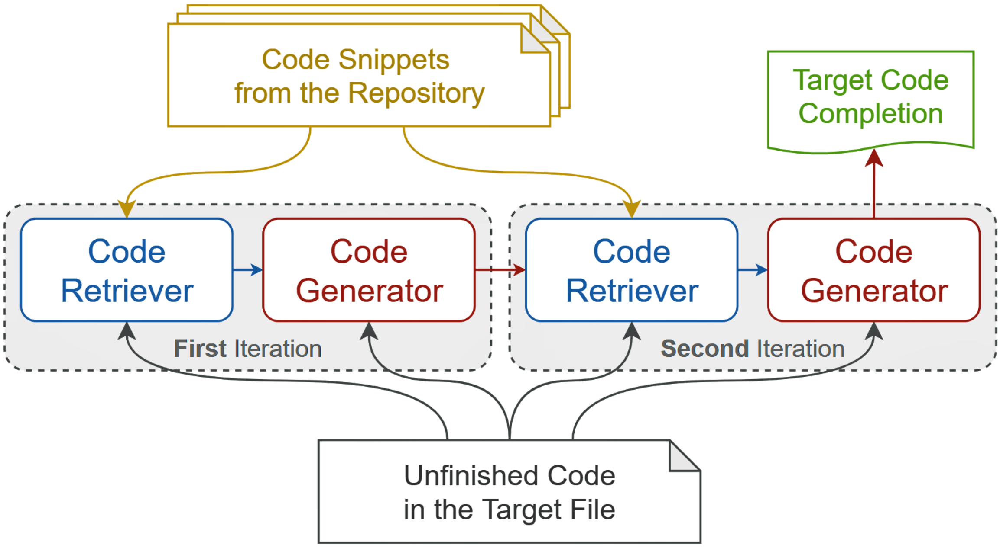

# RepoCoder: Repository-Level Code Completion Through Iterative Retrieval and Generation

# Overview

In the paper, we present **RepoCoder**, a simple, generic, and effective framework to tackle the repository-level code completion task, which is to continue writing the unfinished code based on a broader context of the repository. RepoCoder incorporates a similarity-based retriever, a pre-trained code language model, and a novel iterative retrieval-generation paradigm. It streamlines the overall process and eliminates the need for heuristic rules, static code analysis, data labeling, and model re-training in previous studies. 


<center>
Figure 1. The illustration of our RepoCoder framework.
</center>

We also present a new benchmark, **RepoEval**, for the repository-level code completion task, which consists of the latest and high-quality real-world repositories covering line, API invocation, and function body completion scenarios. We test the performance of RepoCoder and show that it significantly improves the zero-shot code completion baseline by over 10% and consistently outperforms the vanilla retrieval-augmented code completion approach.

## Project

This project contains the basic components of RepoCoder. Here is an overview:

```shell
|-- make_window.py # slice the repository files and the model predictions into code snippets
|-- build_vector.py # build the vector representation for the code snippets
|-- search_code.py # search relevant code snippets with the vector representation
|-- build_prompt.py # build the prompt with the unfinished code and the retrieved code snippets
|-- run_pipeline.py # run the code completion pipeline
|-- compute_score.py # evaluate the performance of the code completion
|-- utils.py # utility functions
|-- datasets/datasets.zip # the input data for the code completion task
    |-- function_level_completion_4k_context_codex.test.jsonl
    |-- function_level_completion_2k_context_codex.test.jsonl
    |-- line_level_completion_4k_context_codex.test.jsonl
    |-- line_level_completion_2k_context_codex.test.jsonl
    |-- line_level_completion_2k_context_codegen.test.jsonl
    |-- line_level_completion_1k_context_codegen.test.jsonl
    |-- api_level_completion_4k_context_codex.test.jsonl
    |-- api_level_completion_2k_context_codex.test.jsonl
    |-- api_level_completion_2k_context_codegen.test.jsonl
    |-- api_level_completion_1k_context_codegen.test.jsonl
|-- repositories # the checkpoints of repositories used to build our benchmark
    |-- function_level.zip 
      |-- CarperAI_trlx
      |-- lucidrains_imagen-pytorch
      |-- deepmind_tracr
      |-- leopard-ai_betty
      |-- google_lightweight_mmm
      |-- amazon-science_patchcore-inspection
      |-- facebookresearch_omnivore
      |-- maxhumber_redframes
    |-- line_and_api_level.zip
      |-- pytorch_rl
      |-- opendilab_ACE
      |-- google_vizier
      |-- awslabs_fortuna
      |-- huggingface_evaluate
      |-- huggingface_diffusers
      |-- nerfstudio-project_nerfstudio
      |-- alibaba_FederatedScope
```

We utilize a private library to handle the execution and evaluation of the function-level completion. Due to the license issue, we cannot release the code. However, we provide the data for the function-level completion task in `datasets/datasets.zip` and `repositories/function_level.zip`.

# Quickstart

## Prepare Environment
First, we should set up a python environment. This code base has been tested under python 3.8.

```bash
$ conda create -n repocoder python=3.8
$ conda activate repocoder
$ pip install -r requirements.txt
```

## Run the Code Completion
1. The `run_RG1_and_oracle_method` function in `run_pipeline.py` shows the process of building the prompts for vanilla retrieval-augmented generation (RG1) and the Oracle method. The generated prompts are listed in a .jsonl file, where each line contains the content in the following format:
```json
{
  "prompt": "...the retrieved code snippets and unfinished code...",
  "metadata": {
    "task_id": "repo_name/idx",
    "ground_truth": "ground truth completion",
    "fpath_tuple": ["path", "to", "target file"],
    "context_start_lineno": 0,
    "line_no": 10,
  }
}
```

2. Then we can call the model to generate completions and organize the results in the following format:
```json
{
  "prompt": "...the retrieved code snippets and unfinished code...",
  "choices": [{"text": "...generated completion without repeating the input prompt..."},],
  "metadata": {}
}
```

3. Next, we can evaluate the performance of the code completion with the `compute_score.py` script. The script will compute the Exact Match and Edit Similarity scores.

4. After that, we can use the `run_RepoCoder_method` function in `run_pipeline.py` to run a second iteration of retrieval-generation, which is our proposed RepoCoder approach, using the prediction file of RG1. And finally, we can evaluate the performance of RepoCoder as introduced in Step 3.

# Citation

If our work is useful, please consider citing our paper:

```bibtex
@article{zhang2023repocoder,
  title={RepoCoder: Repository-Level Code Completion Through Iterative Retrieval and Generation},
  author={Zhang, Fengji and Chen, Bei and Zhang, Yue and Liu, Jin and Zan, Daoguang and Mao, Yi and Lou, Jian-Guang and Chen, Weizhu},
  journal={arXiv preprint arXiv:2303.12570},
  year={2023}
}
```

# Contributing

This project welcomes contributions and suggestions.  Most contributions require you to agree to a
Contributor License Agreement (CLA) declaring that you have the right to, and actually do, grant us
the rights to use your contribution. For details, visit https://cla.opensource.microsoft.com.

When you submit a pull request, a CLA bot will automatically determine whether you need to provide
a CLA and decorate the PR appropriately (e.g., status check, comment). Simply follow the instructions
provided by the bot. You will only need to do this once across all repos using our CLA.

This project has adopted the [Microsoft Open Source Code of Conduct](https://opensource.microsoft.com/codeofconduct/).
For more information see the [Code of Conduct FAQ](https://opensource.microsoft.com/codeofconduct/faq/) or
contact [opencode@microsoft.com](mailto:opencode@microsoft.com) with any additional questions or comments.

# License

Please note that this repo is under [MIT License](LICENSE).

# Trademarks

This project may contain trademarks or logos for projects, products, or services. Authorized use of Microsoft 
trademarks or logos is subject to and must follow 
[Microsoft's Trademark & Brand Guidelines](https://www.microsoft.com/en-us/legal/intellectualproperty/trademarks/usage/general).
Use of Microsoft trademarks or logos in modified versions of this project must not cause confusion or imply Microsoft sponsorship.
Any use of third-party trademarks or logos are subject to those third-party's policies.